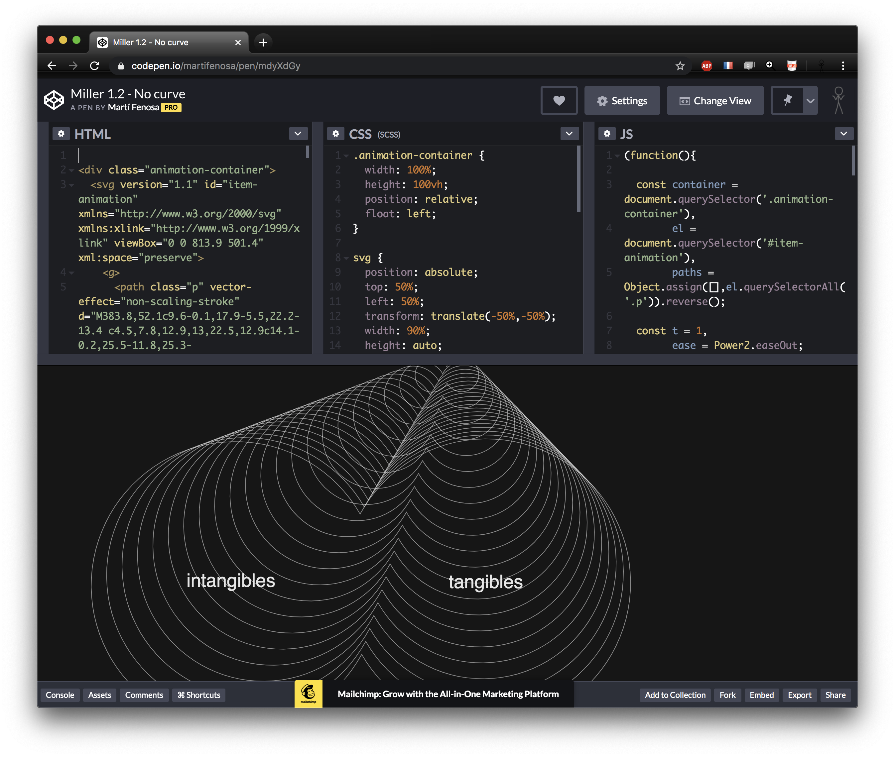

---
jupyter:
  celltoolbar: Slideshow
  jupytext:
    cell_metadata_filter: all
    formats: md
    notebook_metadata_filter: all,-language_info,-jupytext.text_representation.jupytext_version
    text_representation:
      extension: .md
      format_name: markdown
      format_version: '1.2'
      jupytext_version: 1.3.2
  kernelspec:
    display_name: Javascript (Node.js)
    language: javascript
    name: javascript
  notebookname: web frontend ecosystem
  rise:
    autolaunch: true
    slideNumber: c/t
    start_slideshow_at: selected
    theme: sky
    transition: cube
  toc:
    base_numbering: 1
    nav_menu: {}
    number_sections: false
    sideBar: false
    skip_h1_title: false
    title_cell: Table of Contents
    title_sidebar: Contents
    toc_cell: false
    toc_position:
      height: 179px
      left: 143px
      top: 28px
      width: 202.391px
    toc_section_display: true
    toc_window_display: true
  version: '1.0'
---

Licence CC BY-NC-ND
Thierry Parmentelat

# online tools

<!-- #region slideshow={"slide_type": "slide"} -->
## many great online tools
<!-- #endregion -->

* it is sometimes unconvenient to deal with  
  the 3 formalisms HTML - CSS - JavaScript
  in 3 separate files
* esp. for working on / sharing  
  code snippets that outline a specific trick
* many online tools are available, most famous being
  * <https://codepen.io> 
  * also <https://jsfiddle.net> for collaborative work

<!-- #region slideshow={"slide_type": "slide"} -->
## codepen

take a quick look at https://codepen.io/picks/pens/ for great examples

<!-- #endregion -->

<!-- #region slideshow={"slide_type": "slide"} -->
each snippet can be edited online and rendered as you work on it

<!-- #endregion -->
