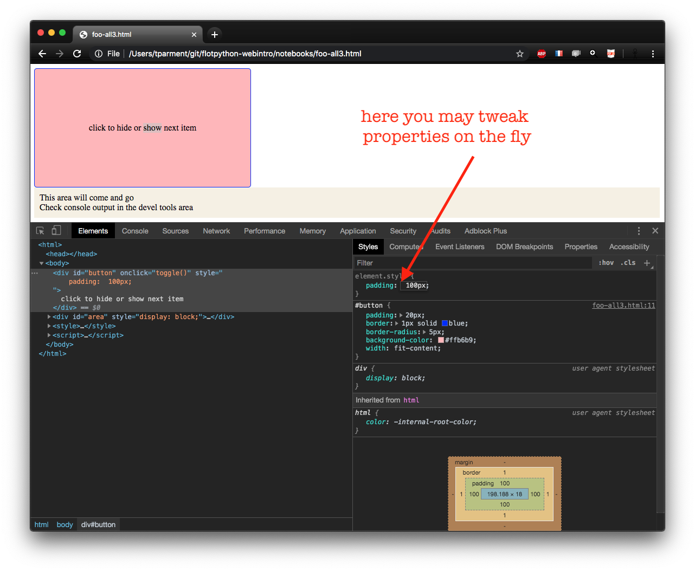
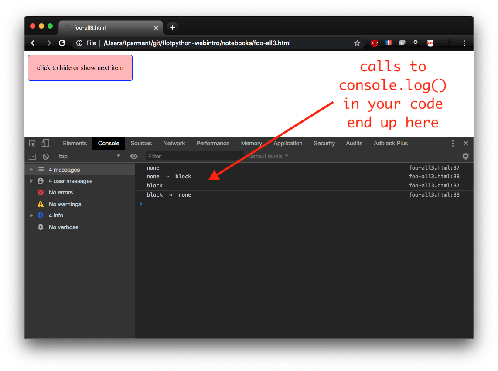
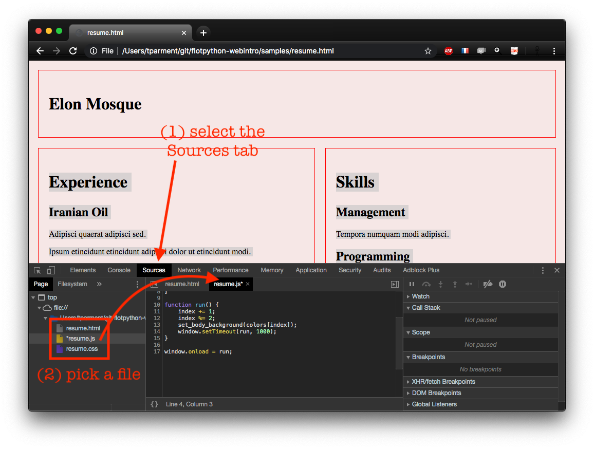

---
jupyter:
  celltoolbar: Slideshow
  jupytext:
    cell_metadata_filter: all
    formats: md
    notebook_metadata_filter: all,-language_info
    text_representation:
      extension: .md
      format_name: markdown
      format_version: '1.2'
      jupytext_version: 1.3.2
  kernelspec:
    display_name: Javascript (Node.js)
    language: javascript
    name: javascript
  notebookname: JS practice
  rise:
    autolaunch: true
    slideNumber: c/t
    start_slideshow_at: selected
    theme: sky
    transition: cube
  toc:
    base_numbering: 1
    nav_menu: {}
    number_sections: true
    sideBar: false
    skip_h1_title: false
    title_cell: Table of Contents
    title_sidebar: Contents
    toc_cell: false
    toc_position:
      height: 247.734px
      left: 1052.98px
      top: 140px
      width: 354.469px
    toc_section_display: true
    toc_window_display: true
  version: '1.0'
---

<!-- #region slideshow={"slide_type": "slide"} -->

Licence CC BY-NC-ND
Thierry Parmentelat

<!-- #endregion -->

<!-- #region slideshow={"slide_type": ""} -->
# practice
<!-- #endregion -->

<!-- #region slideshow={"slide_type": ""} -->
in this notebook :
* a simple assignment
* plus a few tips to get started
<!-- #endregion -->

<!-- #region slideshow={"slide_type": "slide"} -->
## assignment

* create a HTML document
* as a collection of 3 files, 
* say : `resume.html`, `resume.css`, `resume.js`
* make sure the html header loads the css and js companions
<!-- #endregion -->

then 

* edit the JavaScript code
* so that your resume background
* alternates every 1 second
* between 2 different colours
* see example 2 for inspiration

<!-- #region slideshow={"slide_type": "slide"} -->
## tip : use devel tools
<!-- #endregion -->

* crucially important to get familiar with these tools  
*  starting with the most useful ones :
  * *Elements*
  * *Console*
  * and to a lesser extent, *Sources*

<!-- #region slideshow={"slide_type": "slide"} -->
## Devel Tools : *Elements*
<!-- #endregion -->

as mentioned earlier already, you can

* navigate the DOM
* 'Inspect' an element (find an element from a position in the page)
* see the CSS rules that apply to an element 
* find out where these styles come from
* see the computed values for each property
* interactively change a property and see 
  see effect immediately (shown on next slide)

<!-- #region slideshow={"slide_type": "slide"} -->
### visualizing a changed property
<!-- #endregion -->

<!-- #region slideshow={"slide_type": "slide"} -->
## Devel Tools : *Console*
<!-- #endregion -->

* where lands the output of `console.log`  
  of course quite useful for naive debugging
* **and** that lets you issue JavaScript on the fly  
  much like the Python interpreter does

<!-- #region slideshow={"slide_type": "slide"} -->
### the Console REPL
<!-- #endregion -->

* REPL stands for Read, Eval, Print Loop
* illustrated in the following slides

<!-- #region slideshow={"slide_type": "slide"} -->

<!-- #endregion -->

<!-- #region slideshow={"slide_type": "slide"} -->

<!-- #endregion -->

<!-- #region slideshow={"slide_type": "slide"} -->

<!-- #endregion -->

<!-- #region slideshow={"slide_type": "slide"} -->

<!-- #endregion -->

<!-- #region slideshow={"slide_type": "slide"} -->
## Devel Tools : *Sources*
<!-- #endregion -->
occasionnally useful to browse the code actually loaded

<!-- #region slideshow={"slide_type": "slide"} -->
## the browser cache (yet again)
<!-- #endregion -->

* the browser cache thing (see CSS loading)
* applies exactly the same  
* in the case of JavaScript code

**Remember**
* to use Shift-load, or other cache-cleaning tool  
* if changes in a file do not seem to kick in

<!-- #region slideshow={"slide_type": "slide"} -->
## more on devel tools
<!-- #endregion -->

<!-- #region slideshow={"slide_type": ""} -->
* there are standard keyboard shortcuts to invoke devel tools,  
* e.g. for [google chrome](https://developers.google.com/web/tools/chrome-devtools/shortcuts)  
  * macOS `⌘ ⌥ J` (console) or `⌘ ⌥ I` (your last tab)
  * others `⌃ ⇧ J` (console) or `⌃ ⇧ I` (your last tab)
* a bit early for now, but be aware that  
  they come with a complete debugger
* do not hesitate to search for some hands-on / video tuto
<!-- #endregion -->
