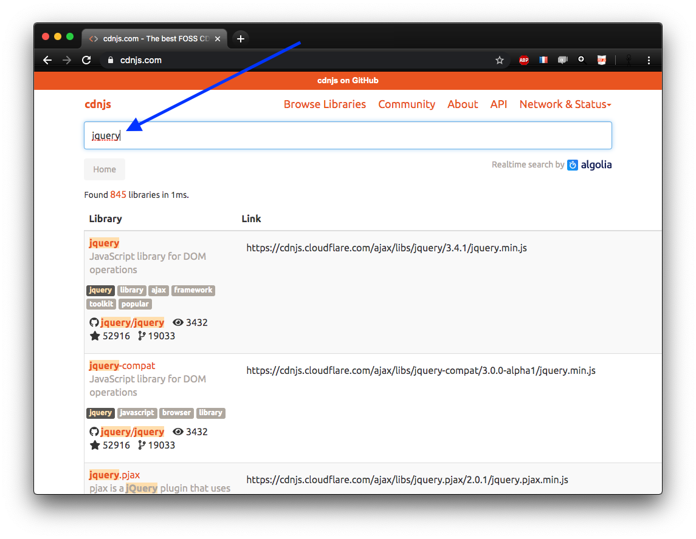
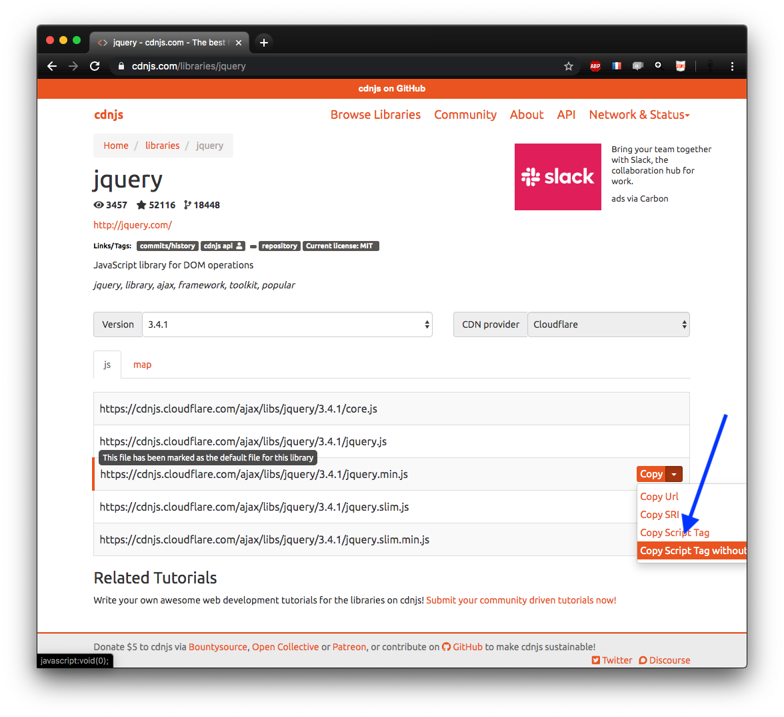
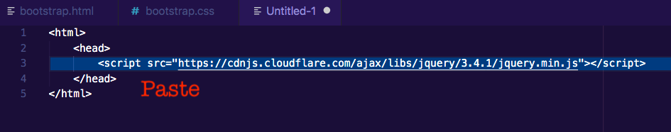

---
jupyter:
  celltoolbar: Slideshow
  jupytext:
    cell_metadata_filter: all
    formats: md
    notebook_metadata_filter: all,-language_info,-jupytext.text_representation.jupytext_version
    text_representation:
      extension: .md
      format_name: markdown
      format_version: '1.2'
      jupytext_version: 1.3.2
  kernelspec:
    display_name: Javascript (Node.js)
    language: javascript
    name: javascript
  notebookname: jQuery
  rise:
    autolaunch: true
    slideNumber: c/t
    start_slideshow_at: selected
    theme: sky
    transition: cube
  toc:
    base_numbering: 1
    nav_menu: {}
    number_sections: true
    sideBar: true
    skip_h1_title: false
    title_cell: Table of Contents
    title_sidebar: Contents
    toc_cell: false
    toc_position:
      height: 247.719px
      left: 1274.52px
      top: 29px
      width: 253.469px
    toc_section_display: true
    toc_window_display: true
  version: '1.0'
---

<!-- #region slideshow={"slide_type": "slide"} -->
<div class="licence">
<span>Licence CC BY-NC-ND</span>
<span>Thierry Parmentelat</span>
</div>
<!-- #endregion -->

<!-- #region slideshow={"slide_type": ""} -->
# jQuery
<!-- #endregion -->

```javascript
// run this cell, and then 
// click the created button
tools = require('../js/tools');
tools.init();
```

<!-- #region slideshow={"slide_type": "slide"} -->
## jQuery is everywhere
<!-- #endregion -->

jQuery has been very early available  
with the objective to make common operations,  
like interactions with the DOM   
much **smoother**, and more **cross-browser**

it is embedded in **many applications**,  
so it is a **must know** component

<!-- #region slideshow={"slide_type": "slide"} -->
## digression : cdnjs
<!-- #endregion -->

* many places where to find 3rd-party libraries like jQuery
* personnally I like <https://cdnjs.com>
* easy to locate resources
* and to import them in your project

<!-- #region slideshow={"slide_type": "slide"} -->

<!-- #endregion -->

<!-- #region slideshow={"slide_type": "slide"} -->

<!-- #endregion -->

<!-- #region slideshow={"slide_type": "slide"} -->

<!-- #endregion -->

<!-- #region slideshow={"slide_type": "slide"} -->
## digression$^2$ 
<!-- #endregion -->

real applications will use more sophisticated tools to deal with dependencies  
most popular being essentially `npm` and/or `yarn`  
that we will cover briefly later on

however this remains quite convenient  
if you use only a handful of 3rd party tools

<!-- #region slideshow={"slide_type": "slide"} -->
## back to jQuery
<!-- #endregion -->

as per <https://jquery.com>

> **What is jQuery?** 

> jQuery is a fast, small, and feature-rich JavaScript library. It makes things like HTML document traversal and manipulation, event handling, animation, and Ajax much simpler with an easy-to-use API that works across a multitude of browsers. With a combination of versatility and extensibility, jQuery has changed the way that millions of people write JavaScript.


<!-- #region slideshow={"slide_type": "slide"} -->
## how to use
<!-- #endregion -->

* after importing jQuery, the whole module is available as the global `$` variable 
* (and yes, this is legal in JavaScript)


```javascript slideshow={"slide_type": "slide"}
tools.iframe_exo("jquery", true, true)
```

```javascript

```
